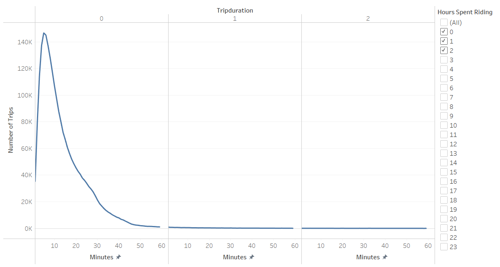

# Tableau Bikesharing Application Data Visualization
## Purpose of Analysis
For this project, the data visualization software Tableau will be employed to visualize bike-sharing data from the Citi Bike application for their New York City stations for the month of August, 2019. This will be done to gain insight on the viability of creating a bike-sharing application for the city of Des Moines, Iowa.   
[Link to  Tableau Dashboard](https://public.tableau.com/app/profile/andrew.carlson1377/viz/NYCCitiBikeStoryModuleChallenge/NYCCitiBikeStoryModuleChallenge?publish=yes)
## Results  
  
* The chart above represents the number of trips by usertype, gender, and day of the week.
* It can be seen that male subscribers are the most common users of Citi Bikes in New York City.
* The day of the week where the most Citi Bike trips occur is Thursday.
* Generally, there are more subscribers that use Citi Bikes than unsubscribed customers.  
  
* The heatmap above represents the number of trips per day by hour.
* With Thursday being the day where the most trips occurred during August of 2019, the busiest times of the day was 8 a.m. in the morning and 5 p.m. to 7. p.m. in the evening. 
* The least amount of trips occur during the late night and early morning.
* The greatest amount of trips is generally in the evenings and closer to the weekend.  
  
* The heatmap above represents the number of trips per day by hour and by gender.
* The heatmap shows that males make up the majority of Citi Bike riders.
* The hourly trends are similar to the previous heatmap that shows the number of trips per day by hour.  
  
* The graph above represents the relationship between the number of trips taken and the amount of time the riders spent riding by the hour and by the minute.
* It can be seen than most of the rides taken are for a duration of less than ten minutes.  
  
* The graph above shows the ride times in minutes for each gender with average values included.
* Males had the highest number of trips, and both males and females show a similar trend in the amount of time their trips lasted.  
  
* The map above shows the difference in popularity of different ride starting locations.
* The darker and larger circles represent the more common starting locations. As indicated in the text box, the area in New York City that has a high concentration of popular starting locations could be due to tourism in that area.  
  
* Similarly as the previous visualization, the map above shows the difference in popularity of different ride ending locations.
* As indicated in the text box, the more popular ending locations are similar to the more popular starting locations.   
## Summary 

